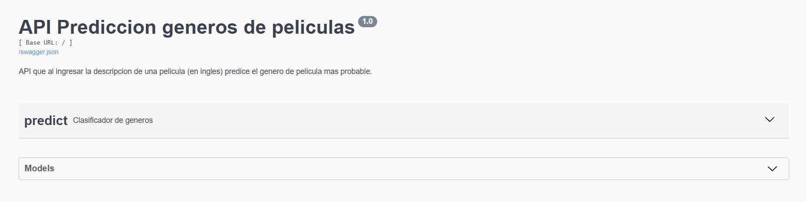
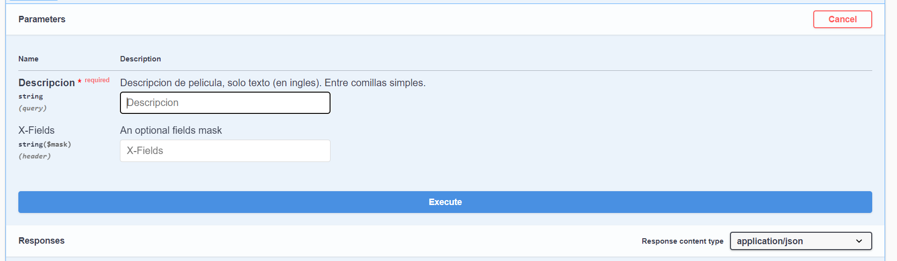
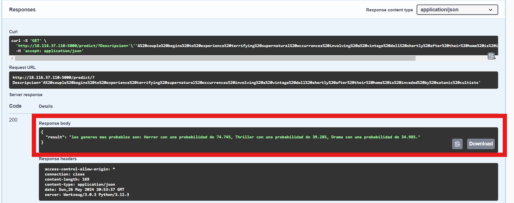

## Proyecto 2 MIAD NLP Grupo 10 - 202412

En este repositorio se encuentra la documentación del proyecto 2 del grupo 10 para la materia de _Machine Learning y procesamiento de Lenguaje Natural_.

### Disponibilización API.

Se disponibiliza una [API](http://18.116.37.110:5000/) que permite al usuario ingresar un texto que sea una descripción (plot) de una película y obtener la predicción de los géneros de pelicula más probables de dicha descripción.

La descripción debe ponerse entre comillas simples, en inglés.

### Ingreso a la API

Para ingresar a la API debe acceder al siguiente [link](http://18.116.37.110:5000/) (http://18.116.37.110:5000/).

Una vez dentro, se debe ver una ventana con el título y la pestaña de predict:

Ahí el usuario deber hacer click en la flecha abajo de predict ->  Flecha abajo de GET Predict -> Try it Out.

Después se activa la barra de Description para escritura de texto. 

Como se sugiere ahí mismo, se debe ingresar un texto en inglés entre comillas simples.

Por ejemplo, se introduce el texto: 'A couple begins to experience terrifying supernatural occurrences involving a vintage doll shortly after their home is invaded by satanic cultists'. Que corresponde a la película de terror de Annabelle. Después se oprime el botón de Execute. A lo que la API arroja el resultado en el apartado de Responses:

En este caso, la API nos indica que los géneros más probables son: Horror con una probabilidad de 74.74%, como era de esperarse, seguido de Thriller con una probabilidad de 39.28%, y finalmente Drama con una probabilidad de 34.98%.

Como tal las probabilidades no suman 100% porque el modelo siempre le asigna una probabilidad a cada género que va de 0% a 100%. Aquí devolvemos los 3 géneros más probables.

Solo se consideran los siguientes 24 géneros:

['Action','Adventure','Animation','Biography','Comedy','Crime','Documentary','Drama','Family','Fantasy','Film-Noir','History','Horror','Music','Musical','Mystery','News','Romance','Sci-Fi','Short','Sport','Thriller','War','Western']

## Nota de funcionamiento

La API fue lanzada en una instancia Ubuntu de AWS, siendo un microservicio t2 con 10 GB de memoria. La API se basa en un modelo light que fue el que mejor desempeño obtuvo en nuestras pruebas. La API permite la predicción de una sola entrada a la vez.